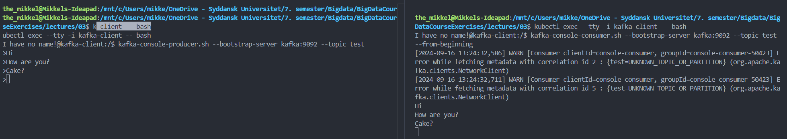
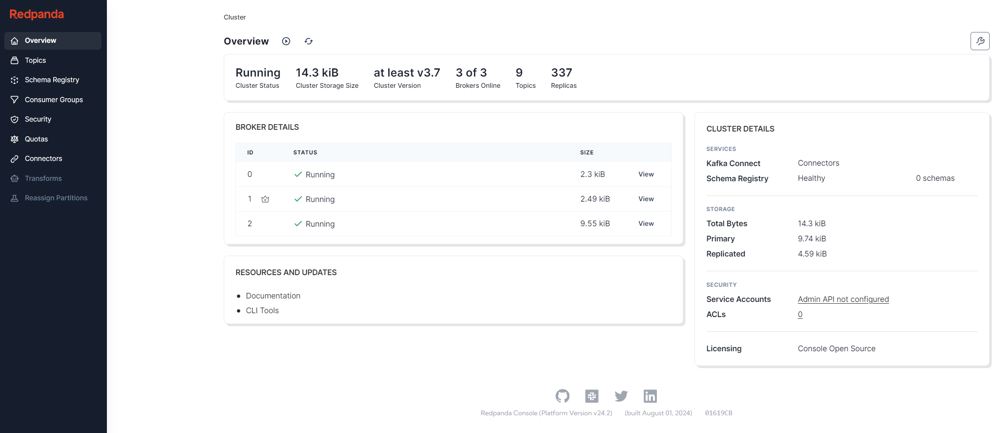
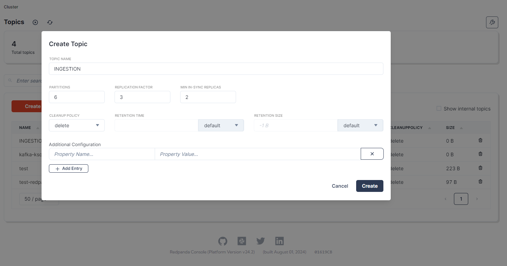

# Solution

This document contains the solutions to the exercises in the lecture.

- [Solution](#solution)
  - [Exercise 1](#exercise-1)
    - [Validation](#validation)
  - [Exercise 2](#exercise-2)
    - [Service validation](#service-validation)
      - [Kafka Schema registry](#kafka-schema-registry)
      - [Kafka Connect](#kafka-connect)
      - [Kafka KSQL](#kafka-ksql)
  - [Exercise 3](#exercise-3)
  - [Exercise 4](#exercise-4)
    - [Task 1 - Properties of topic](#task-1---properties-of-topic)
    - [Task 2 - Create topic](#task-2---create-topic)
    - [Task 3 - What will sensor id key do](#task-3---what-will-sensor-id-key-do)
    - [Task 4 - Recreate powergrid sampler to post to Kafka](#task-4---recreate-powergrid-sampler-to-post-to-kafka)

## Exercise 1

First, we need to deploy the cluster.  
For this we follow the helm install command from the documentation:

```bash
helm install --values kafka-values.yaml kafka oci://registry-1.docker.io/bitnamicharts/kafka --version 30.0.4
```

Then we can check the status of the pods:

```bash
kubectl get all
```

The output then looks like this:

```txt
NAME                     READY   STATUS    RESTARTS   AGE
pod/kafka-controller-0   1/1     Running   0          78s
pod/kafka-controller-1   1/1     Running   0          78s
pod/kafka-controller-2   1/1     Running   0          78s

NAME                                TYPE        CLUSTER-IP       EXTERNAL-IP   PORT(S)                      AGE
service/kafka                       ClusterIP   10.152.183.158   <none>        9092/TCP                     78s
service/kafka-controller-headless   ClusterIP   None             <none>        9094/TCP,9092/TCP,9093/TCP   78s

NAME                                READY   AGE
statefulset.apps/kafka-controller   3/3     78s
```

### Validation

Now we need to validate that the Kafka cluster was deployed correctly.  
To do this, the first task is to create a topic, then produce a message and finally consume the message.

To do this, we use a client pod to interact with the Kafka cluster.

```bash
kubectl run kafka-client --restart='Never' --image docker.io/bitnami/kafka:3.8.0-debian-12-r3  --command -- sleep infinity
```

The output then looks like this:

```txt
pod/kafka-client created
```

From here, we use a shell in the client pod to interact with the Kafka cluster.

```bash
kubectl exec --tty -i kafka-client -- bash
```

We are using two terminals from here, both connected through the above command.  
In the first terminal, we use a console producer, and in the second terminal, we use a console consumer.

In the first terminal, we create a topic:

```bash
kafka-console-producer.sh --bootstrap-server kafka:9092 --topic test
```

In the second terminal, we consume the message:

```bash
kafka-console-consumer.sh --bootstrap-server kafka:9092 --topic test --from-beginning
```

Now we can write a message in the first terminal and see it appear in the second terminal.

```txt
> Hello, World!
```

The output in the second terminal then looks like this:

```txt
Hello, World!
```

The following screenshot shows the two consoles side by side:


We then delete the kafka client pod:

```bash
kubectl delete pod kafka-client
```

## Exercise 2

This execise is about Kafka Connect, Kafka Schema Registry, and Kafka KSQL.

The first task is about familiarizing with the three deployment files for the beforementioned services.

- [kafka-schema-registry.yaml](./kafka-schema-registry.yaml)
- [kafka-connect.yaml](./kafka-connect.yaml)
- [kafka-ksqldb.yaml](./kafka-ksqldb.yaml)

In them, we see config maps, services, deployments as well as storage claims (for Kafka Connect).

The second task is to deploy the services.  
This can be done by running the following commands (*As noted in the instructions*):

```bash
kubectl apply --filename=kafka-schema-registry.yaml,kafka-connect.yaml,kafka-ksqldb.yaml
```

After the deployment, we can check the status of the pods:

```bash
kubectl get all
```

The output then looks like this:

```txt
NAME                                        READY   STATUS    RESTARTS   AGE
pod/kafka-connect-5c76db745f-hrdwl          1/1     Running   0          59s
pod/kafka-controller-0                      1/1     Running   0          22m
pod/kafka-controller-1                      1/1     Running   0          22m
pod/kafka-controller-2                      1/1     Running   0          22m
pod/kafka-ksqldb-cli-b74fb48c4-fzr7j        1/1     Running   0          59s
pod/kafka-ksqldb-server-56b6c66847-6sfrm    1/1     Running   0          59s
pod/kafka-schema-registry-794b485bb-946q9   1/1     Running   0          59s

NAME                                TYPE        CLUSTER-IP       EXTERNAL-IP   PORT(S)                      AGE
service/kafka                       ClusterIP   10.152.183.158   <none>        9092/TCP                     22m
service/kafka-connect               NodePort    10.152.183.250   <none>        8083:30374/TCP               59s
service/kafka-controller-headless   ClusterIP   None             <none>        9094/TCP,9092/TCP,9093/TCP   22m
service/kafka-ksqldb-server         NodePort    10.152.183.212   <none>        8088:31879/TCP               59s
service/kafka-schema-registry       ClusterIP   10.152.183.56    <none>        8081/TCP                     59s

NAME                                    READY   UP-TO-DATE   AVAILABLE   AGE
deployment.apps/kafka-connect           1/1     1            1           59s
deployment.apps/kafka-ksqldb-cli        1/1     1            1           59s
deployment.apps/kafka-ksqldb-server     1/1     1            1           59s
deployment.apps/kafka-schema-registry   1/1     1            1           59s

NAME                                              DESIRED   CURRENT   READY   AGE
replicaset.apps/kafka-connect-5c76db745f          1         1         1       59s
replicaset.apps/kafka-ksqldb-cli-b74fb48c4        1         1         1       59s
replicaset.apps/kafka-ksqldb-server-56b6c66847    1         1         1       59s
replicaset.apps/kafka-schema-registry-794b485bb   1         1         1       59s

NAME                                READY   AGE
statefulset.apps/kafka-controller   3/3     22m
```

Then the instructions says to change some values in the config map for the redpanda deployment in [redpanda.yaml](./redpanda.yaml).

*This was already done (not by me), so we can skip this step.*

### Service validation

Now we can interact with the services.

#### Kafka Schema registry

To test the schema registry, we can follow the instructions in the exercise.

```bash
kubectl port-forward svc/kafka-schema-registry 8081:8081
```

Then we can open the browser and go to [http://localhost:8081](http://localhost:8081).  
Returned is:

```json
{}
```

#### Kafka Connect

The same can be done for the Kafka Connect service.

```bash
kubectl port-forward svc/kafka-connect 8083:8083
```

Then we can open the browser and go to [http://localhost:8083](http://localhost:8083).
Returned is:

```json
{"version":"7.3.1-ce","commit":"a453cbd27246f7bb","kafka_cluster_id":"OijWyl0mcQDmVsdNmz5dRN"}
```

#### Kafka KSQL

The KsqlDB service is a bit different, as we can use the KsqlDB CLI to interact with it.

```bash
kubectl exec --stdin --tty deployment/kafka-ksqldb-cli -- ksql http://kafka-ksqldb-server:8088
```

The output is then:

```txt
                  ===========================================
                  =       _              _ ____  ____       =
                  =      | | _____  __ _| |  _ \| __ )      =
                  =      | |/ / __|/ _` | | | | |  _ \      =
                  =      |   <\__ \ (_| | | |_| | |_) |     =
                  =      |_|\_\___/\__, |_|____/|____/      =
                  =                   |_|                   =
                  =        The Database purpose-built       =
                  =        for stream processing apps       =
                  ===========================================

Copyright 2017-2022 Confluent Inc.

CLI v7.3.1, Server v7.3.1 located at http://kafka-ksqldb-server:8088
Server Status: RUNNING

Having trouble? Type 'help' (case-insensitive) for a rundown of how things work!

ksql> exit
Exiting ksqlDB.
```

These services respond in line with the expectations, and the deployment is successful.

## Exercise 3

This exercise focuses on the Redpanda deployment.

To deploy, we can use the provided [redpanda.yaml](./redpanda.yaml) file.

```bash
kubectl apply -f redpanda.yaml
```

After the deployment, we can check the status of the pods:

```bash
kubectl get all
```

The output then looks like this:

```txt
NAME                                        READY   STATUS    RESTARTS   AGE
pod/kafka-connect-5c76db745f-hrdwl          1/1     Running   0          30m
pod/kafka-controller-0                      1/1     Running   0          52m
pod/kafka-controller-1                      1/1     Running   0          52m
pod/kafka-controller-2                      1/1     Running   0          52m
pod/kafka-ksqldb-cli-b74fb48c4-fzr7j        1/1     Running   0          30m
pod/kafka-ksqldb-server-56b6c66847-6sfrm    1/1     Running   0          30m
pod/kafka-schema-registry-794b485bb-946q9   1/1     Running   0          30m
pod/redpanda-7b8b757c5d-kkgpb               1/1     Running   0          5s

NAME                                TYPE        CLUSTER-IP       EXTERNAL-IP   PORT(S)                      AGE
service/kafka                       ClusterIP   10.152.183.158   <none>        9092/TCP                     52m
service/kafka-connect               NodePort    10.152.183.250   <none>        8083:30374/TCP               30m
service/kafka-controller-headless   ClusterIP   None             <none>        9094/TCP,9092/TCP,9093/TCP   52m
service/kafka-ksqldb-server         NodePort    10.152.183.212   <none>        8088:31879/TCP               30m
service/kafka-schema-registry       ClusterIP   10.152.183.56    <none>        8081/TCP                     30m
service/redpanda                    ClusterIP   10.152.183.225   <none>        8080/TCP                     5s

NAME                                    READY   UP-TO-DATE   AVAILABLE   AGE
deployment.apps/kafka-connect           1/1     1            1           30m
deployment.apps/kafka-ksqldb-cli        1/1     1            1           30m
deployment.apps/kafka-ksqldb-server     1/1     1            1           30m
deployment.apps/kafka-schema-registry   1/1     1            1           30m
deployment.apps/redpanda                1/1     1            1           5s

NAME                                              DESIRED   CURRENT   READY   AGE
replicaset.apps/kafka-connect-5c76db745f          1         1         1       30m
replicaset.apps/kafka-ksqldb-cli-b74fb48c4        1         1         1       30m
replicaset.apps/kafka-ksqldb-server-56b6c66847    1         1         1       30m
replicaset.apps/kafka-schema-registry-794b485bb   1         1         1       30m
replicaset.apps/redpanda-7b8b757c5d               1         1         1       5s

NAME                                READY   AGE
statefulset.apps/kafka-controller   3/3     52m
```

We can now try to access the Redpanda service by port forwarding:

```bash
kubectl port-forward svc/redpanda 8080:8080
```

Then we can open the browser and go to [http://localhost:8080](http://localhost:8080).



We can then see the overview of the Kafka cluster, including the topics, brokers, and partitions.  
Especially can we see the internal Kafka items and the "test" topic we created earlier.

## Exercise 4

This exercise an extension on lecture 2 exercise 10, where we created a power sampler in python for hdfs. This time we will use the same sampler but for Kafka, where Kafka Connect will push it to hdfs.

### Task 1 - Properties of topic

- How many partitions will you have for the `INGESTION` topic?
  - For the powergrid sampler, we want up to 3 consumers (fictive number, but this is the real constraint).  
  This means we need at least 3 partitions, to allow for parallel consumption.  
  We can increase this to 6 partitions, to allow for more consumers in the future.
- Which replication factor will you use for the `INGESTION` topic?
  - Since the cluster is small, we can use a replication factor of 3, mathcing the number of brokers and reaching HA minimum.
- Which min in-sync replicas will you use for the `INGESTION` topic?
  - For reliability and HA, we should at least have 2 in-sync replicas.  
    This allows for the loss of one broker without data loss and with continued operation.
- What would be an appropriate retention time for the `INGESTION` topic?
  - For a powergrid reader, which uses kafka connect to push to hdfs, we can use a retention time of 1 day. This allows for small downtime and still allows for the data to be read by the consumer.  
  - If we see, that we may use the messages for longer, this can be increased to 7 days or longer.
- What would be an appropriate retention size for the `INGESTION` topic?
  - Currently there is no guide to, how many datapoints fits in a given size, but we can use a size of 1GB. This allows for a good amount of data to be stored, while still being able to be read by the consumer, without the need for a large amount of storage.  
  - If we see, that 1 GB is too small over time, we can increase the size to 10 GB.

### Task 2 - Create topic

Create `INGESTION` topic with the properties from the previous task.  
This is done in the redpanda web interface.



### Task 3 - What will sensor id key do

Question: Which property will be possible if you add a key, which defines the sensor id, to each record?

Answer:

It will be possible for one consumer to receive all data for the single sensor, and only that consumer, as all sensor data will be in the same partition.

### Task 4 - Recreate powergrid sampler to post to Kafka

The powergrid sampler is recreated to post to Kafka.

This is done in the [powergrid-sampler](./powergrid-sampler) directory.

The sampler is then deployed to the cluster.

```bash
kubectl apply -f powergrid-sampler/k8s/
```
